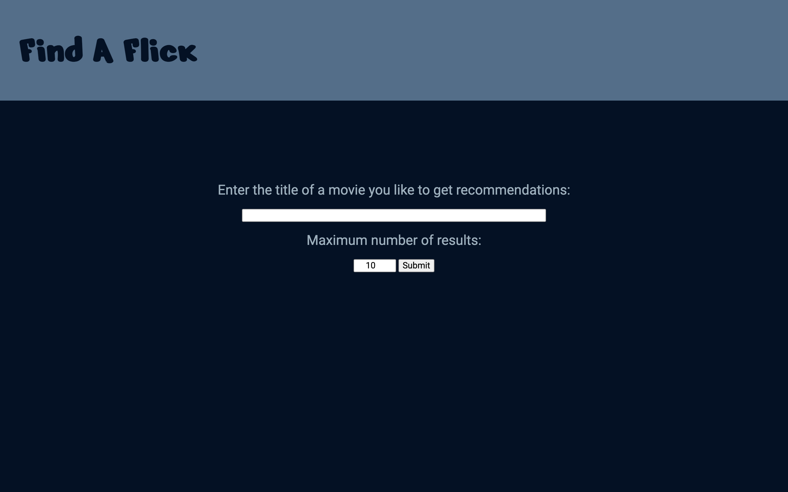
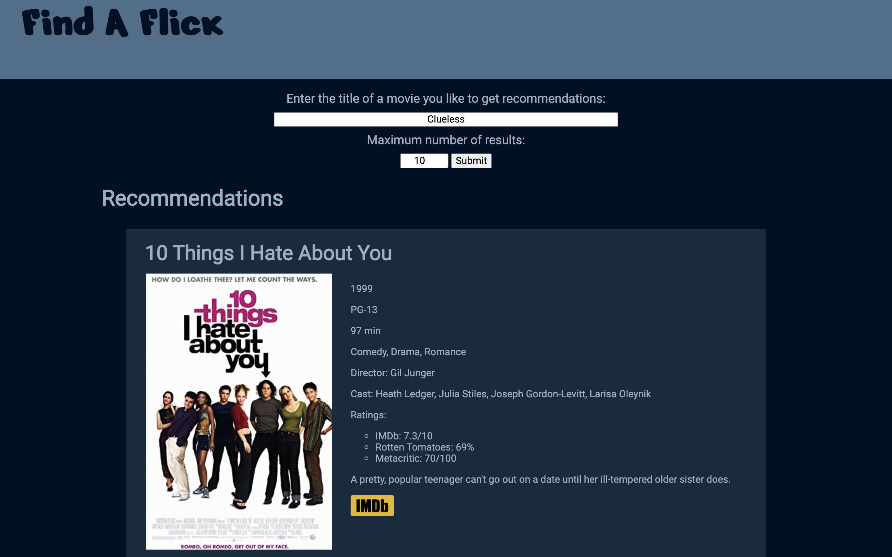
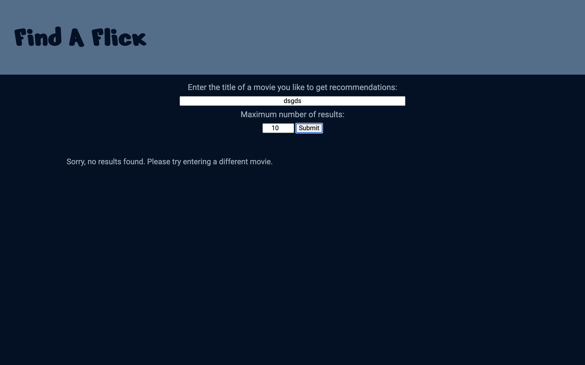

# Find A Flick
https://brendanloomis.github.io/find-a-flick/

A movie recommendation app that gives a user a list of recommended movies based on a movie that they enter.

## Screenshots
Landing Page:

Recommendations Page:

No Results Page:

## Summary

In this app, the user can enter the title of a movie they like and the maximum number of recommendations they want to receive (1 - 30). The app will return a list of recommendations that includes information about each movie including the rating, year, cast, and plot summary. If the movie that the user entered is not found, then they will be shown the no results screen.

## Technology Used

* HTML
* CSS
* JavaScript
* jQuery